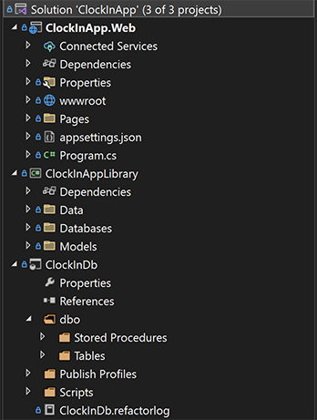

# ClockInApp
The Clock In App allows employees to clock into and out of their shifts. Employees must use their employee PIN codes to log in to their Employee Portal. From their portal, the employee is given an option to clock in or out of their shift, depending on their ClockInStatus.

I learned the structure of this application from [Tim Corey's C# MasterCourse](https://www.iamtimcorey.com/courses/csharp-mastercourse/). The basic structure is a Class Library and SQL Database backend with any UI frontend. In the future, I will add features to this structure to create apps with added complexity.

# Usage
1. Clone the Repository
2. Publish the ClockInDB project to your local machine
	a. Create a Publish Profile to replace mine
3. Ctrl+Click>Properties on your newly created `ClockInDb` table
4. Copy and paste the Connection string into ASP.NET core project appsettings.json
5. Debug to run. Note: Make sure your ClockInApp.Web is your startup app.

# Project Structure📚
Three projects are holding together this application, an ASP.NET Core Web App, a Class Library, and a SQL Server Database Project. It's a UI, Class Library, and Database. The structure of this project allows for any UI project to take the place of the ASP.NET Core Web App or an addition of several UI's. For example: a Web App to only allow reading the shift times, and a Desktop app to allow clock-ins and clock-outs.

Example of the solution folder:  
  
The Table project contains 3 folders, `/dbo/`,`/Publish Profiles/`, and `/Scripts/`. The only script file in the `/Scripts`/ folder is one used for PostDeployment, and it plugs in initial values. So, as soon as the Table is published to the local database, the program runs this script and plugs in initial values. `Publish Profile` allows for quick publishing of the table to the local database for efficient updates to the Store Procedures. The `/dbo/` folder contains the required Tables and the Stored Procedures that affect these tables.

The Class Library Project contains everything a UI needs to speak to the Database. The Folders within the `/ClockInAppLibrary/` are separated by User->SQL Server Data (Data), SQL Server Data -> Data Access (Databases), and Models. Both the `Data` and `DataAccess` folders contain a class and an interface, DataAccess being the lowest level just beneath Data. 

The DataAccess layer is a generic that allows calls from and to any SQL Version. In this case, the project uses SQL Server, but SQL Lite, MySQL, etc. can easily replace it. The Data folder contains the code that speaks to the SQL Server Database. Here is where the CRUD structure is formed and where you learn Stored Procedures are your best friend. The separation of SQL Server Data from Data Access allows Dependency Injection of any SQL Version in the UI. 

The UI could be of any type and ASP.NET Core Web App was chosen for practice. This UI Project has two pages, the initial login and the employee portal. The User enters their employee PIN, and the database receives the PIN and returns the Employee model. Their employee portal opens up, interface varies on clock-in status.

# Future Versions🔮
- User Authentication
- UI Design Polishing
- Desktop App allows Clock-In, Web App used for reading shift times
- Web App counts shift times and payment calculator
